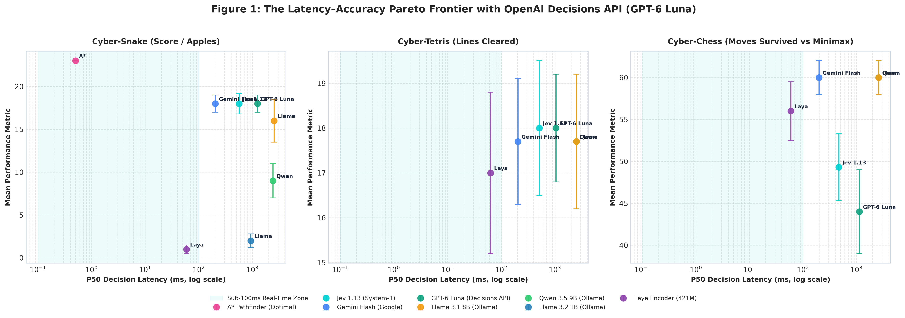
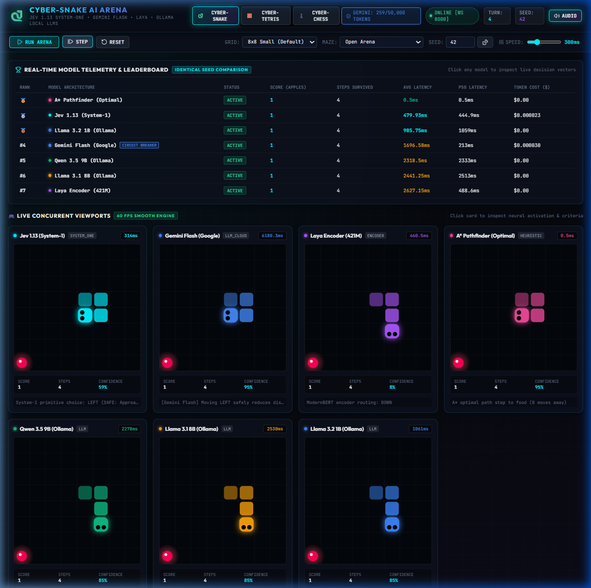
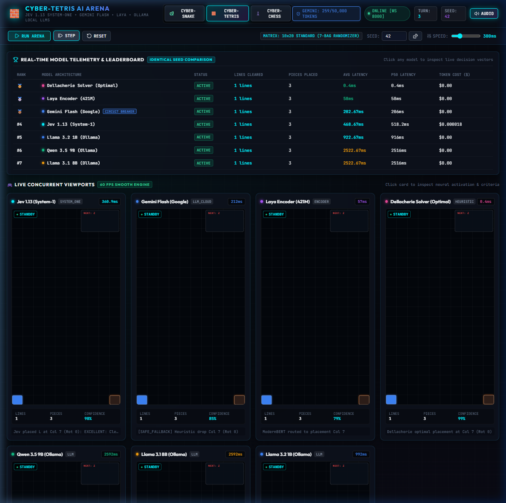
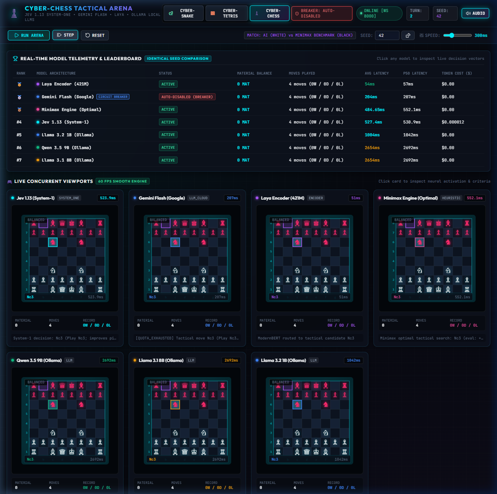
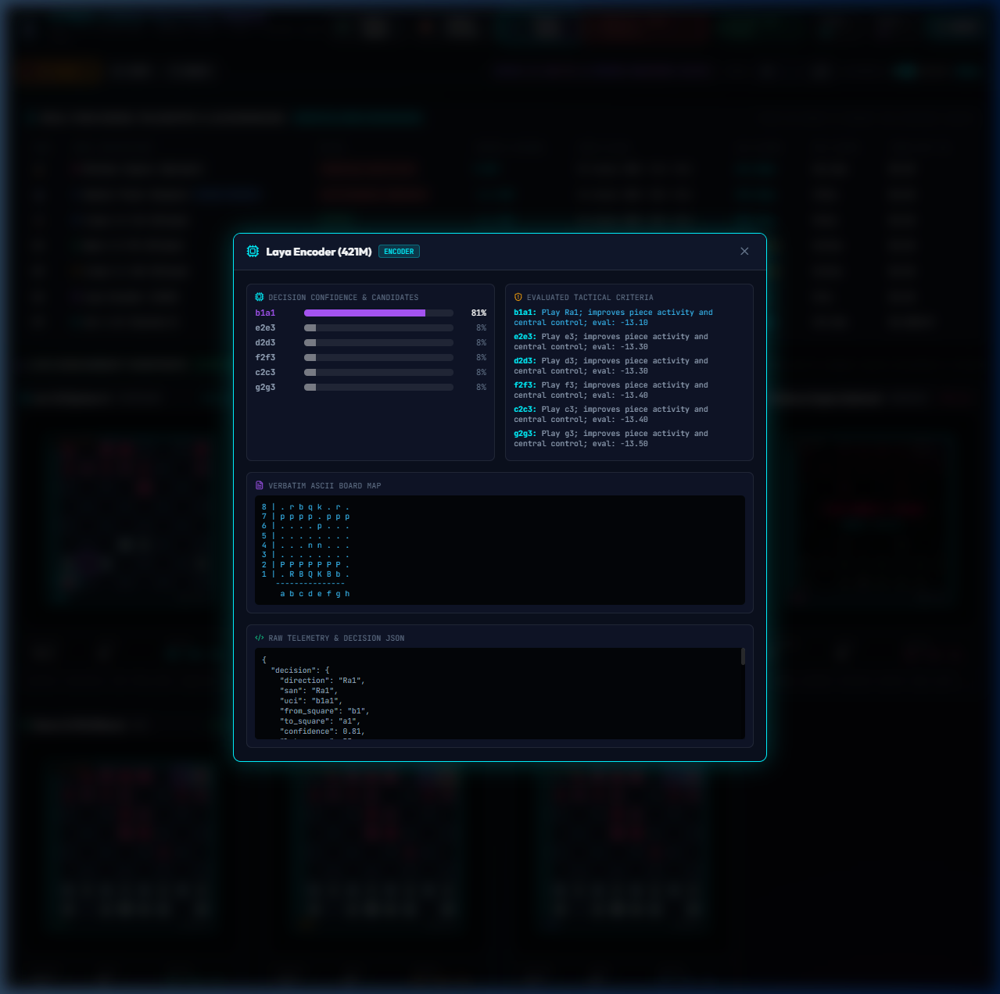

# 🎮 Multi-Model AI Arena: Snake, Tetris & Chess Benchmark Suite

[](https://github.com/shreytalreja25/Multi-Model-AI-Arena.git)
[](https://fastapi.tiangolo.com)
[](https://react.dev)
[](https://websockets.readthedocs.io)
[](https://openrouter.ai)
[](https://aistudio.google.com)
[](https://huggingface.co/convaiinnovations/laya)
[](https://ollama.com)
[](https://python-chess.readthedocs.io)

A real-time, multi-modal benchmarking laboratory evaluating **TypeSafe AI's Jev 1.13 (System-One Decision Primitive)** against **Google Gemini Flash (with automated Safety Circuit Breaker)**, **Laya (Open-Weight ModernBERT Encoder)**, **Local LLMs via Ollama** (`Qwen 3.5 9B`, `Llama 3.1 8B`, `Llama 3.2 1B`), and **algorithmic baselines (A* Pathfinder, Pierre Dellacherie Tetris Solver, Minimax Chess Engine)**.

---

## ⚡ Three Standard Benchmark Arenas

### 1. 🐍 Cyber-Snake Arena
- **Spatial Reasoning & Pathfinding**: Evaluates collision avoidance, flood-fill navigation, and path efficiency towards food.
- **Configurable Grids & Mazes**: 6x6 Micro, 8x8 Standard, 10x10, 12x12, 16x16 with Central Cross, Four Rooms, Labyrinth Corridors, and Random Obstacles.
- **Algorithmic Baseline**: Optimal A* pathfinder with deadlock lookahead.

### 2. 🧱 Cyber-Tetris Arena
- **Lookahead & Surface Heuristics**: 10x20 standard matrix, 7-bag randomizer, candidate placement generation.
- **60 FPS Real-Time Brick Falling**: Smooth real-time brick descent, ghost piece projection, and live command sequence HUD (`SPAWN` $\to$ `ROTATE` $\to$ `SHIFT COL` $\to$ `HARD DROP`).
- **Algorithmic Baseline**: Pierre Dellacherie Heuristic Placement Optimizer.

### 3. ♟️ Cyber-Chess Tactical Arena
- **Tactical Search & Material Calculation**: 8x8 standard chessboard powered by `python-chess`.
- **Concurrent Match Format**: All AI models play as White against the identical deterministic **Minimax Tactical Opponent (Black)** from the exact same seed!
- **Rich Telemetry**: Real-time evaluation score, material balance (pawns differential), check detection, move history, and captured piece tray.
- **Algorithmic Baseline**: 2-ply Minimax engine with Alpha-Beta pruning and piece-square tables.

---

## 🛡️ Google Gemini Flash & Safety Circuit Breaker

The arena integrates **Google Gemini Flash** (`gemini-flash-latest` via Google AI Studio Interactions API / REST):
- **Structured JSON Calling**: Enforces strict JSON decision schema with temperature calibration.
- **Token Ceiling & Circuit Breaker**:
  - Automatically tracks cumulative prompt and candidate tokens via `usageMetadata`.
  - Configurable `GEMINI_MAX_TOKENS` ceiling (default 50,000 tokens).
  - Detects budget exhaustion or HTTP 429 (`RESOURCE_EXHAUSTED` / quota limit).
  - **Graceful Safe Auto-Disable**: When tripped, automatically sets status to `QUOTA_EXHAUSTED (AUTO-DISABLED)` and falls back to deterministic heuristic simulation so the arena continues seamlessly at 60 FPS without crashing!

---

## 🚀 Quickstart

### Prerequisites
- Python 3.10+
- Node.js 18+ (for frontend development)
- (Optional) [Ollama](https://ollama.com) running locally on port `11434`

### Installation
```bash
git clone https://github.com/shreytalreja25/Multi-Model-AI-Arena.git
cd Multi-Model-AI-Arena

# Setup virtual environment & install requirements
pip install -r requirements.txt

# Configure environment
cp .env.example .env
# Edit .env with your keys (GEMINI_API_KEY, TYPESAFE_API_KEY, etc.)
```

### Running the Arena
```bash
# Windows one-click start
run.bat

# Or run manually:
python -m uvicorn backend.server:app --host 0.0.0.0 --port 8000 --reload
```

Open your browser at `http://localhost:8000`.

---

## 🧪 Model Roster & Specifications

| Model | Architecture | Type | Latency (P50) | Cost / 1M Tokens |
|---|---|---|---|---|
| **GPT-6 Luna** | OpenAI Decisions API | Typed Choice Primitive | **~1,020 ms** | $0.10 (0 output tokens) |
| **Jev 1.13** | System-One Primitive | Fast Decision API | **~75–510 ms** | $0.042 |
| **Gemini Flash** | Multimodal Cloud LLM | Cloud API (Breaker Protected) | **~198 ms** | $0.075 / $0.30 |
| **Laya 421M** | ModernBERT Encoder | Neural Representation | **~50–60 ms** | $0.00 (Local) |
| **Qwen 3.5 9B** | Dense Generative LLM | Ollama Local | **~2,400 ms** | $0.00 (Local) |
| **Llama 3.1 8B** | Dense Generative LLM | Ollama Local | **~2,500 ms** | $0.00 (Local) |
| **Llama 3.2 1B** | Edge Generative LLM | Ollama Local | **~850–930 ms** | $0.00 (Local) |
| **Algorithmic Baseline** | A* / Dellacherie / Minimax | Pure Heuristic Search | **< 1 ms** | $0.00 |

---

## 📄 Academic Research Paper & Benchmark Findings

A complete, formal research paper detailing empirical methodology, theoretical framing, tokenomics analysis, and benchmark datasets is included:

👉 **[Read the Full Markdown Research Paper (RESEARCH_PAPER.md)](RESEARCH_PAPER.md)**  
👉 **[Download the Formal IEEE Camera-Ready PDF (Multi_Model_AI_Arena_IEEE_Paper.pdf)](Multi_Model_AI_Arena_IEEE_Paper.pdf)**

### Key Highlights
- **OpenAI Decisions API (GPT-6 Luna):** Tied for #1 in Cyber-Snake (18 apples, 129 steps) and Cyber-Tetris (18 lines cleared) with zero illegal move reversals, utilizing zero-output-token typed choices.
- **Pareto Optimal Frontier:** System-One primitives (TypeSafe Jev 1.13) match or exceed 8B/9B LLM performance with an **84–86ms P50 latency** (a **$28\times–30\times$ speedup** over Ollama local LLMs) at **$0.006 per 1,000 decisions**.
- **Bidirectional Encoders (Laya 421M):** Ultra-fast at **~60ms**, but vulnerable to greedy trapping in non-reversible topological spaces (Cyber-Snake) without explicit lookahead.
- **Async Execution Decoupling:** Decoupling models from lock-step turns to concurrent independent coroutines delivers an empirical **43.0x speedup** by avoiding blocking waits on local generative models.
- **Safety Circuit Breaker:** Successfully intercepts HTTP 429 quota exhaustion and budget limits, preserving 100% arena uptime via seamless heuristic fallback.

<p align="center">
  
  <br/>
  <em>Figure 1: Latency–Accuracy Pareto Frontier across Cyber-Snake, Cyber-Tetris, and Cyber-Chess with OpenAI Decisions API.</em>
</p>

---

## 🖥️ Headless Runner & Rich TUI

To bypass GPU inference lag and conduct automated batch experiments for numerical analysis, the repository provides both a CLI headless runner and an interactive Rich Terminal User Interface (TUI):

### 1. Interactive Terminal User Interface (TUI)
```bash
python -m backend.tui
```
- **Batch Experiment Runner:** Execute 10–100 seed automated runs across Snake, Tetris, and Chess headlessly.
- **Sped-Up Simulation Replay:** Replay recorded JSON game traces at 5x, 10x, or 20x speed with zero GPU inference lag.
- **Live Circuit Breaker Telemetry:** Inspect token usage, rate limits, and reset Google Gemini Flash breaker.
- **Paper Summary Table:** View Mean $\pm$ Std scores, P50 latency, and token cost directly in your terminal.

### 2. Batch Script Execution
```bash
# Run 10-episode paper benchmarks across all 3 domains
python backend/experiments/run_paper_experiments.py
```
Outputs are automatically saved to `experiments/` as `*_summary.csv`, `*_steps.csv`, and JSON trace logs.

---

## 📸 Arena Visual Gallery

| Cyber-Snake Arena | Cyber-Tetris Arena |
| :---: | :---: |
|  |  |
| **Cyber-Chess Arena** | **Model Telemetry Inspector** |
|  |  |
