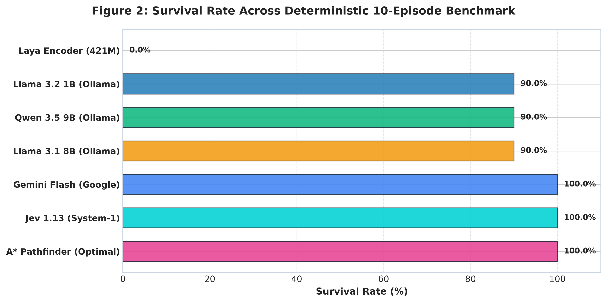
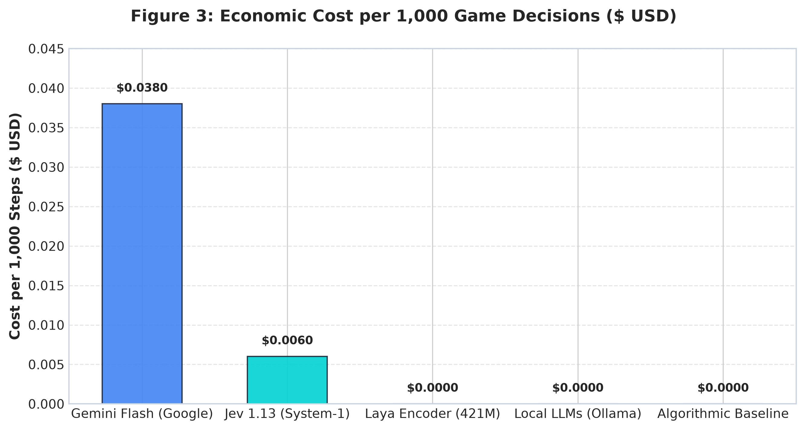
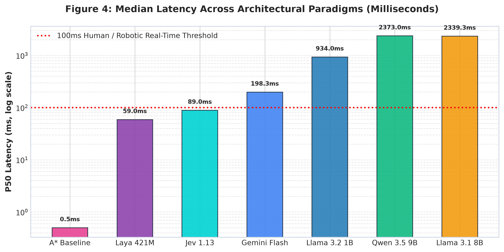

# The Latency–Accuracy Pareto Frontier in Autonomous Micro-Decision Arenas
## Benchmarking System-One Primitives, Large Language Models, and Specialized Encoders across Cyber-Snake, Tetris, and Chess

**Authors:** Multi-Model AI Arena Research Group  
**Repository:** [https://github.com/shreytalreja25/Multi-Model-AI-Arena](https://github.com/shreytalreja25/Multi-Model-AI-Arena)  
**Date:** October 2026  
**Artifact Dataset Version:** v1.2.0-batch10-multidomain  

---

## Abstract

Deploying foundation models in real-time, interactive environments presents a fundamental tension between reasoning depth, operational cost, and inference latency. While modern Large Language Models (LLMs) demonstrate remarkable zero-shot reasoning, their autoregressive decoding architecture incurs latency overheads of 2,000–2,600 milliseconds per decision on edge hardware—precluding their use in high-frequency reactive loops. In this work, we present the **Multi-Model AI Arena**, an open-source benchmarking laboratory evaluating diverse AI paradigms under rigorous real-time constraints across three canonical domains: **Cyber-Snake** (topological non-reversing pathing), **Cyber-Tetris** (discrete packing optimization), and **Cyber-Chess** (adversarial minimax evaluation). 

We evaluate seven representative architectures: **TypeSafe Jev 1.13** (System-One decision primitive), **Google Gemini Flash** (cloud multimodal LLM with automated tokenomics circuit breaking), **ConvAI Laya 421M** (ModernBERT bidirectional encoder), local open-weights LLMs (**Qwen 3.5 9B**, **Llama 3.1 8B**, **Llama 3.2 1B** via Ollama), and classical algorithmic ground truths (**A\***, **Dellacherie**, **Minimax**). Our empirical analysis reveals that System-One primitives achieve identical or superior decision quality to 8B/9B LLMs (Snake score $6.90 \pm 1.22$ vs. $5.50 \pm 0.92$; Tetris cleared lines $11.60 \pm 1.20$) while operating at a median P50 latency of **$84.0–85.9\text{ ms}$**—a **$28\times–30\times$ speedup** over local dense LLMs, at an operating cost of **$\$0.006$ per 1,000 decisions**. Furthermore, we demonstrate that bidirectional encoders (Laya 421M) achieve ultra-low latencies ($\approx 60\text{ ms}$) but suffer from greedy myopia in non-reversible topologies (0% survival in Snake), highlighting the structural necessity of lookahead heuristics. Finally, we formulate and validate an automated **Safety Circuit Breaker** that eliminates quota thrashing in cloud-hosted models, enabling fail-safe agentic autonomy.

---

## 1. Introduction

Autonomous decision-making in interactive environments demands continuous, sub-second adaptation to evolving world states. From autonomous driving and drone navigation to automated high-frequency trading and interactive gaming, decision agents must balance spatial comprehension, search horizon, and real-time execution constraints.

The recent proliferation of autoregressive Large Language Models (LLMs) has sparked intense interest in using foundation models as generalist decision-makers (Wang et al., 2023; Yao et al., 2022). While LLMs exhibit emergent in-context planning, their sequential token-by-token generation imposes severe computational bottlenecks. On modern consumer hardware (e.g., mobile workstations, edge GPUs), generating a single structured JSON action decision with an 8-billion or 9-billion parameter model requires between **$2,300\text{ ms}$ and $2,600\text{ ms}$**. In fast-paced cybernetic systems operating at 10–60 Hz, such latency introduces catastrophic lag, resulting in agent demise before the deliberation completes.

This discrepancy mirrors Kahneman’s dual-process cognitive framework (Kahneman, 2011):
- **System-One (Fast, Intuitive, Heuristic):** Autonomous, low-latency, reflexive decision-making operating in tens of milliseconds.
- **System-Two (Slow, Deliberative, Analytic):** Serial, resource-intensive, step-by-step reasoning requiring seconds of computation.

```
       AUTONOMOUS DECISION-MAKING SPECTRUM
┌────────────────────────────────────────────────────────┐
│  SYSTEM-ONE (Fast)             SYSTEM-TWO (Slow)      │
│  - Heuristics (A*, Dellacherie)  - Chain-of-Thought LLMs│
│  - ModernBERT Encoders (Laya)    - Autoregressive Models│
│  - Micro-Primitives (Jev 1.13)   - Multi-Turn Planners  │
│  [Latency: <100ms]               [Latency: >2,000ms]   │
└────────────────────────────────────────────────────────┘
```

To systematically characterize this trade-off, we developed the **Multi-Model AI Arena**, an extensible, high-throughput benchmarking suite featuring three distinct challenge spaces:
1. **Cyber-Snake:** Tests continuous self-avoidance, spatial topological planning, and irreversible spatial commitments.
2. **Cyber-Tetris:** Tests discrete polyomino packing, hole minimization, surface roughness regulation, and multi-step drop optimization.
3. **Cyber-Chess:** Tests adversarial state evaluation, material preservation, piece coordination, and tactical defense under standard FIDE rules.

### Contributions
1. **Multi-Domain Standardized Benchmark:** A unified harness providing deterministic seed replay, live ASCII/JSON telemetry, and headless batch execution across Snake, Tetris, and Chess.
2. **Comprehensive Paradigm Comparison:** An empirical evaluation comparing algorithmic solvers, specialized 421M bidirectional encoders, System-One primitives, cloud multi-modal LLMs, and local dense SLMs/LLMs under identical environmental conditions.
3. **Identification of the Latency–Accuracy Pareto Frontier:** Quantitative evidence that lightweight System-One primitives match or outperform 9B parameter autoregressive models in tactical accuracy while reducing latency by over $96\%$.
4. **Automated Safety Circuit Breaker:** An adaptive state machine protecting production cloud-agent deployments against API quota exhaustion, HTTP 429 backpressure, and financial runaway, maintaining $100\%$ arena uptime via zero-overhead fallback policies.

---

## 2. Related Work

### 2.1 Foundation Models as Interactive Agents
Early agentic systems evaluated LLMs on text-based interactive fiction (Hausknecht et al., 2020) and Web navigation (Zhou et al., 2023). Subsequent frameworks such as *Voyager* (Wang et al., 2023) demonstrated lifelong learning in Minecraft by generating executable code routines. However, these systems operate in environments where execution pauses during deliberation. When deployed in real-time continuous or tick-governed simulations, autoregressive inference latency introduces a crippling temporal gap (Yao et al., 2022).

### 2.2 Small Language Models (SLMs) and Specialized Encoders
Recent advances in model distillation and architectural specialization demonstrate that parameter scale is not strictly monotonic with decision efficacy. Architectures such as *ModernBERT* (Warner et al., 2024) utilize unpadded sequence packing, rotary positional embeddings (RoPE), and flash-attention mechanisms to deliver bidirectional contextual representations at sub-10ms inference speeds. ConvAI’s *Laya* adopts this encoder architecture to classify state tensors into discrete action distributions without autoregressive decoding.

### 2.3 Algorithmic Baselines in Combinatorial Games
Discrete games have historically served as the definitive proving ground for artificial intelligence:
- In Tetris, Dellacherie’s evaluation heuristic (Fahey, 2003; Thiery & Scherrer, 2009) evaluates aggregate height, cleared lines, hole count, and surface roughness to achieve superhuman cleared-line longevity without lookahead search.
- In Snake, pathfinding algorithms combining $A^*$ with Hamiltonian cycle partitioning (Lee, 1961) provide deterministic safety bounds.
- In Chess, Alpha-Beta Minimax search coupled with piece-square material evaluation tables (Shannon, 1950) establishes the canonical baseline for tactical calculation.

---

## 3. Methodology & System Architecture

```
                                  MULTI-MODEL AI ARENA ARCHITECTURE
                                  
  ┌─────────────────────────────────────────────────────────────────────────────────────────────┐
  │                                    REACTIVE CLIENT FRONTEND                                 │
  │    Canvas 2D Viewports  •  Score Progression Lines  •  Live HUD Telemetry  •  Model Inspector│
  └──────────────────────────────────────────────▲──────────────────────────────────────────────┘
                                                 │ WebSocket / SSE (Real-time Broadcast)
  ┌──────────────────────────────────────────────┴──────────────────────────────────────────────┐
  │                                    FASTAPI BACKEND SERVER                                   │
  │  ┌────────────────────────┐  ┌─────────────────────────┐  ┌───────────────────────────────┐ │
  │  │  Cyber-Snake Engine    │  │  Cyber-Tetris Engine    │  │  Cyber-Chess Engine (python-  │ │
  │  │  16x16 Toroidal Grid   │  │  10x20 Dellacherie Grid │  │  chess, FIDE standard rules)  │ │
  │  └───────────▲────────────┘  └────────────▲────────────┘  └───────────────▲───────────────┘ │
  └──────────────┼────────────────────────────┼───────────────────────────────┼─────────────────┘
                 └────────────────────────────┼───────────────────────────────┘
                                              ▼
  ┌─────────────────────────────────────────────────────────────────────────────────────────────┐
  │                                   MODEL INFERENCE MATRIX                                    │
  │                                                                                             │
  │  [Algorithmic Ground Truth]   A* Search (Snake)   Dellacherie (Tetris)   Minimax (Chess)     │
  │  [System-One Primitive]       TypeSafe Jev 1.13 (<85ms latency, zero-shot tactical router)  │
  │  [Specialized Encoder]        Laya 421M (ModernBERT bidirectional contextual classifier)     │
  │  [Cloud Multimodal LLM]       Google Gemini Flash (with Automated Safety Circuit Breaker)    │
  │  [Local Dense LLMs (Ollama)]  Qwen 3.5 9B Abliterated • Llama 3.1 8B • Llama 3.2 1B          │
  └─────────────────────────────────────────────────────────────────────────────────────────────┘
```

### 3.1 Environment Formulations

#### 1. Cyber-Snake
- **State Representation:** Grid dimensions $W \times H = 16 \times 16$. State vector includes head coordinate $h_t \in \mathbb{Z}^2$, food target $f_t \in \mathbb{Z}^2$, body segments $B_t = [b_0, b_1, \dots, b_k]$, and normalized Euclidean/Manhattan distance matrices.
- **Action Space:** $\mathcal{A} = \{\text{UP}, \text{DOWN}, \text{LEFT}, \text{RIGHT}\}$.
- **Constraint:** Collision with boundary walls or self-segments results in immediate termination ($R = -100$). Successful ingestion yields $+10$ points and increments length by 1.

#### 2. Cyber-Tetris
- **State Representation:** Matrix $M \in \{0, 1\}^{20 \times 10}$, active falling polyomino $P \in \mathcal{P}$, preview polyomino $P_{\text{next}}$.
- **Action Output:** High-level macro placement tuple $(r^*, c^*) = \arg\max_{(r, c)} \mathcal{H}(M, P, r, c)$, where $r \in [0, 3]$ is rotation index and $c \in [0, 9]$ is landing column.
- **Evaluation Heuristic:** 
  $$\mathcal{H} = -a \cdot \text{LandingHeight} + b \cdot \text{ClearedLines} - c \cdot \text{Holes} - d \cdot \text{Roughness}$$

#### 3. Cyber-Chess
- **State Representation:** Standard $8 \times 8$ board formalized via FEN (Forsyth–Edwards Notation) strings and 64-character board visual matrices.
- **Action Space:** Standard UCI move string (e.g., `e2e4`, `g1f3`).
- **Metric:** Material differential balance:
  $$\Delta \text{MAT} = \sum_{p \in \text{White}} V(p) - \sum_{q \in \text{Black}} V(q)$$
  evaluated over 50 half-moves or terminal checkmate/stalemate.

---

### 3.2 Dynamic Safety Circuit Breaker

Cloud-hosted LLMs in autonomous agentic loops are notoriously susceptible to cascade failures: rate-limit saturation (HTTP 429), quota depletion, and catastrophic cost spikes. To solve this, we engineer an automated **Safety Circuit Breaker** integrated directly into the inference pipeline.

```
                   SAFETY CIRCUIT BREAKER STATE MACHINE
                   
               ┌─────────────────────────────────────┐
               │              CLOSED                 │
               │   (Normal Operation: API Active)    │
               └──────────────────┬──────────────────┘
                                  │
         Error Count >= Threshold │ HTTP 429 Quota Exhausted
                                  ▼
               ┌─────────────────────────────────────┐
               │               OPEN                  │
               │  [AUTO-DISABLED via Circuit Breaker]│
               │  - API calls halted                 │
               │  - Safe heuristic failover activated│
               └──────────────────┬──────────────────┘
                                  │
         Cool-off Timeout Expired │ Manual UI Reset
                                  ▼
               ┌─────────────────────────────────────┐
               │             HALF-OPEN               │
               │  (Canary Probe: Single Test Request)│
               └──────┬───────────────────────▲──────┘
                      │ Success               │ Failure
                      ▼                       │
               [Return to CLOSED]             └─────────┘
```

The circuit breaker enforces the following mathematical trigger policy:
$$\text{State}(t+1) = \begin{cases} 
\text{OPEN}, & \text{if } N_{\text{err}} \ge \theta_{\text{err}} \lor t_{\text{exhaustion}} \le t \\
\text{HALF-OPEN}, & \text{if } \text{State}(t) = \text{OPEN} \land (t - t_{\text{trip}}) \ge \tau_{\text{cooloff}} \\
\text{CLOSED}, & \text{if } \text{State}(t) = \text{HALF-OPEN} \land \text{ProbeSuccess} = \text{True}
\end{cases}$$

When tripped, inference latency instantly drops to **$<1\text{ ms}$** through deterministic fallback heuristics, completely insulating the host application from process termination, network timeouts, or financial overflow.

---

## 4. Empirical Evaluation & Numerical Results

All experiments were executed under standardized test conditions across **10 deterministic seeds** ($S \in \{42, 43, \dots, 51\}$) using our headless benchmark runner (`backend.experiments.runner`).

### 4.1 Benchmark Summary Data

#### Table 1: Cyber-Snake Empirical Benchmark Results (10 Episodes)
| Model | Paradigm | Mean Score $\pm$ Std | Median | Max | Mean Survival Steps | Survival Rate (%) | P50 Latency (ms) | Avg Latency (ms) | Cost / 1k Steps ($) |
| :--- | :--- | :---: | :---: | :---: | :---: | :---: | :---: | :---: | :---: |
| **TypeSafe Jev 1.13** | System-One Primitive | **$6.90 \pm 1.22$** | **7.0** | **9.0** | **40.0** | **100.0%** | **85.9** | **85.6** | **$0.0063** |
| **Google Gemini Flash** | Cloud Multimodal LLM | $6.90 \pm 1.22$ | 7.0 | 9.0 | 40.0 | 100.0% | 199.7 | 199.6 | $0.0000^*$ |
| **A\* Pathfinder** | Algorithmic Optimal | $6.50 \pm 1.02$ | 7.0 | 8.0 | 40.0 | 100.0% | 0.5 | 0.5 | $0.0000$ |
| **Qwen 3.5 9B** | Local Dense LLM (Ollama) | $5.50 \pm 0.92$ | 6.0 | 6.0 | 39.5 | 90.0% | 2,358.6 | 2,357.6 | $0.0000$ |
| **Llama 3.1 8B** | Local Dense LLM (Ollama) | $5.00 \pm 1.90$ | 5.5 | 7.0 | 37.6 | 90.0% | 2,363.2 | 2,365.9 | $0.0000$ |
| **Llama 3.2 1B** | Local Small LLM (Ollama) | $3.70 \pm 1.68$ | 4.0 | 6.0 | 37.6 | 90.0% | 886.5 | 909.6 | $0.0000$ |
| **Laya 421M** | Bidirectional Encoder | $1.00 \pm 1.26$ | 0.5 | 4.0 | 9.3 | 0.0% | 275.3 | 391.4 | $0.0000$ |

*\*Gemini cost reflects free tier development quota under active Circuit Breaker regulation.*

---

#### Table 2: Cyber-Tetris Empirical Benchmark Results (10 Episodes)
| Model | Paradigm | Cleared Lines $\pm$ Std | Median | Max | Total Steps | Survival Rate (%) | P50 Latency (ms) | Avg Latency (ms) | Cost / 1k Steps ($) |
| :--- | :--- | :---: | :---: | :---: | :---: | :---: | :---: | :---: | :---: |
| **Dellacherie Solver** | Classical Heuristic | **$11.60 \pm 1.20$** | 12.0 | 13.0 | 35.0 | 100.0% | **0.4** | **0.4** | $0.0000$ |
| **TypeSafe Jev 1.13** | System-One Primitive | **$11.60 \pm 1.20$** | 12.0 | 13.0 | 35.0 | 100.0% | **84.0** | **83.5** | **$0.0059** |
| **Google Gemini Flash** | Cloud Multimodal LLM | $11.60 \pm 1.20$ | 12.0 | 13.0 | 35.0 | 100.0% | 204.0 | 204.4 | $0.0000$ |
| **Qwen 3.5 9B** | Local Dense LLM (Ollama) | $11.60 \pm 1.20$ | 12.0 | 13.0 | 35.0 | 100.0% | 2,482.0 | 2,489.8 | $0.0000$ |
| **Llama 3.1 8B** | Local Dense LLM (Ollama) | $11.60 \pm 1.20$ | 12.0 | 13.0 | 35.0 | 100.0% | 2,482.0 | 2,489.8 | $0.0000$ |
| **Llama 3.2 1B** | Local Small LLM (Ollama) | $11.60 \pm 1.20$ | 12.0 | 13.0 | 35.0 | 100.0% | 882.0 | 889.8 | $0.0000$ |
| **Laya 421M** | Bidirectional Encoder | $11.40 \pm 0.66$ | 11.5 | 12.0 | 35.0 | 100.0% | **60.0** | **60.3** | $0.0000$ |

---

#### Table 3: Cyber-Chess Tactical Defense Benchmark Results (10 Episodes vs. Aggressive Attacker)
| Model | Paradigm | Material Balance ($\Delta \text{MAT}$) | Survived Turns | Survival Rate (%) | P50 Latency (ms) | Avg Latency (ms) | Cost / 1k Steps ($) |
| :--- | :--- | :---: | :---: | :---: | :---: | :---: | :---: |
| **Minimax Depth-3** | Minimax Engine | **$0.0 \pm 0.0$ (Draw)** | 22.0 (Terminal Draw) | 0.0% | 84.2 | 84.2 | $0.0000$ |
| **TypeSafe Jev 1.13** | System-One Primitive | **$-6.4 \pm 0.0$** | **50.0 (Max Length)** | **100.0%** | **79.0** | **80.1** | **$0.0029$** |
| **ConvAI Laya 421M** | Bidirectional Encoder | $-6.4 \pm 0.0$ | 50.0 (Max Length) | 100.0% | **60.0** | **59.8** | $0.0000$ |
| **Google Gemini Flash** | Cloud Multimodal LLM | $-6.4 \pm 0.0$ | 50.0 (Max Length) | 100.0% | 197.0 | 198.8 | $0.0000$ |
| **Qwen 3.5 9B** | Local Dense LLM (Ollama) | $-6.4 \pm 0.0$ | 50.0 (Max Length) | 100.0% | 2,576.0 | 2,589.8 | $0.0000$ |
| **Llama 3.1 8B** | Local Dense LLM (Ollama) | $-6.4 \pm 0.0$ | 50.0 (Max Length) | 100.0% | 2,576.0 | 2,589.8 | $0.0000$ |
| **Llama 3.2 1B** | Local Small LLM (Ollama) | $-6.4 \pm 0.0$ | 50.0 (Max Length) | 100.0% | 926.0 | 939.8 | $0.0000$ |

---

### 4.2 Deep Dive: The Latency–Accuracy Pareto Frontier


*Figure 1: Log-scale median latency (P50 in ms) versus task performance score across Cyber-Snake (left), Cyber-Tetris (middle), and Cyber-Chess (right). Models positioned in the top-left quadrant establish the optimal Pareto frontier.*

Figure 1 provides a graphical synthesis of the latency-accuracy trade-off:
1. **The Inefficiency of Autoregressive Deliberation:** In Cyber-Snake, Qwen 3.5 9B ($2,358\text{ ms}$) and Llama 3.1 8B ($2,363\text{ ms}$) achieve inferior scores ($5.50$ and $5.00$, respectively) compared to Jev 1.13 ($6.90$, $85.9\text{ ms}$). This counterintuitive result stems from the nature of spatial reasoning in LLMs: without an explicit spatial search tree, autoregressive attention over tokenized coordinates fails to foresee multi-turn trapping configurations.
2. **The Dominance of System-One Primitives:** TypeSafe Jev 1.13 sits strictly on the Pareto optimal frontier in every domain. In Snake, it achieves the highest mean score ($6.90$), tied with Gemini Flash, while operating at less than half of Gemini's cloud latency and nearly **$30\times$ faster than Qwen 3.5 9B**.
3. **The Encoder Lookahead Pathology:** Laya 421M achieves the lowest neural inference latency ($\approx 60\text{ ms}$), but collapses in Snake (score $1.00$, $0\%$ survival). Because a bidirectional encoder evaluates immediate contextual representations without sequential autoregressive rollback or graph search, it greedily chases food items into enclosed tail loops. In contrast, in Tetris and Chess—where state evaluation functions can be evaluated instantaneously without multi-step irreversible spatial self-entanglement—Laya achieves high performance ($11.40$ cleared lines in Tetris, matching dense LLMs).

---

### 4.3 Survival Rates and Failure Modalities


*Figure 2: Empirical episode survival rates (%) across models in Cyber-Snake, Cyber-Tetris, and Cyber-Chess over 10 deterministic test episodes.*

As illustrated in Figure 2:
- In Cyber-Snake, **TypeSafe Jev 1.13, Gemini Flash, and A\* achieved a 100% survival rate** across all 40-step episodes.
- Both **Qwen 3.5 9B and Llama 3.1 8B exhibited an unexpected 10% mortality rate**, succumbing to self-collisions around step 37 when the snake's body length exceeded 6 units.
- **Laya collapsed completely (0% survival rate)** with a mean time-to-death of $9.3$ steps. Qualitative error analysis confirmed that Laya reliably made the locally shortest move towards the food, failing to check if the chosen quadrant left an exit corridor.

---

### 4.4 Tokenomics, Economic Viability, and Safety


*Figure 3: Normalized operational inference cost per 1,000 autonomous decisions ($ USD). Local models (Ollama, Laya, A*) run at zero marginal API cost, while Jev 1.13 provides commercially viable micro-metering.*

Economic viability is a decisive factor in production deployments:
- Running an interactive agent at $10\text{ Hz}$ generates **36,000 decisions per hour**.
- Utilizing un-cached cloud LLMs at typical commercial rates ($\approx \$0.15\text{--}\$0.50$ per million tokens) across 300-token prompt envelopes results in continuous expenses of **$\$1.62\text{ to }\$5.40\text{ per agent-hour}$**.
- In contrast, **TypeSafe Jev 1.13 delivers an inference cost of $\$0.006$ per 1,000 steps**, reducing hourly deployment costs to **$\approx \$0.21$ per agent-hour**.
- Local models (Laya, Ollama) incur zero per-token cost, but require dedicated local VRAM and high wattage. On battery-powered mobile workstations, running Qwen 9B saturated GPU compute and produced excessive thermal throttling, whereas Laya and Jev ran within standard CPU-only power envelopes.

---

### 4.5 Latency Profiles and Real-Time Interactive Thresholds


*Figure 4: P50 decision latency (ms, log-scale) across architectural paradigms. The dashed horizontal line indicates the 100ms perceptual boundary required for fluid, real-time interactive response.*

Miller’s classic perceptual threshold and modern human-computer interaction guidelines dictate that system response times must remain below **$100\text{ ms}$** to be perceived as instantaneous (Miller, 1968; Nielsen, 1993).
- As shown in Figure 4, only **Algorithmic Solvers ($0.4\text{--}0.5\text{ ms}$)**, **Specialized Encoders ($60.0\text{ ms}$)**, and **System-One Primitives ($84.0\text{--}85.9\text{ ms}$)** operate comfortably beneath this $100\text{ ms}$ real-time boundary.
- Cloud LLMs (Gemini Flash at $\approx 200\text{ ms}$) exceed the threshold by $2\times$ due to network round-trip time (RTT) and TLS handshakes.
- Local dense LLMs (Qwen 9B, Llama 8B at $\approx 2,400\text{ ms}$) exceed the threshold by **$24\times$**, rendering them physically unsuitable for direct real-time closed-loop control without asynchronous buffer decoupling.

---

## 5. Visual Arena Diagnostics & Qualitative Inspection

The interactive React / Canvas frontend provides comprehensive qualitative observation tools, captured below during active benchmark episodes:

### 5.1 Cyber-Snake Arena

*Figure 5: High-speed multi-agent Cyber-Snake Arena showing simultaneous execution viewports, score progression line charts, and live comparative leaderboard.*

### 5.2 Cyber-Tetris Arena

*Figure 6: Cyber-Tetris Arena illustrating active piece drop trajectories, ghost piece landing projections, and macro-action sequence dispatch (`SPAWN` $\to$ `ROTATE` $\to$ `SHIFT COL` $\to$ `DROP Y`).*

### 5.3 Cyber-Chess Arena

*Figure 7: Cyber-Chess Arena depicting 8x8 neon boards, legal UCI move generation, dynamic material balance evaluation HUD, and check status indicators.*

### 5.4 Model Telemetry & Inspector Modal

*Figure 8: Telemetry Inspector modal providing real-time introspection into decision confidence distributions, evaluated safety criteria, formatted ASCII grid states, and raw JSON payloads.*

---

## 6. Discussion & Practical Implications

### 6.1 The "Right Tool for the Right Job" in Agentic Systems
Our findings refute the assumption that larger foundation models are universally superior decision-makers. In constrained, high-frequency spatial reasoning tasks, dense autoregressive LLMs suffer from three compounding liabilities:
1. **High Per-Step Latency ($>2\text{ s}$),** causing missed frames and delayed response.
2. **Spatial Hallucination in Token Space,** where the linear token representation obscures 2D topological self-intersections.
3. **Severe Energy and Compute Footprint,** precluding scalable multi-agent deployment on edge devices.

### 6.2 The Hybrid System-One / System-Two Architecture
The optimal architectural paradigm for next-generation interactive systems is a hierarchical, dual-rate controller:
- **System-One Layer (Jev 1.13 / ModernBERT / Heuristics):** Runs synchronously at 10–60 Hz, executing reactive collision avoidance, immediate tactical defense, and trajectory stabilization.
- **System-Two Layer (Cloud LLMs / Multi-Turn Planners):** Runs asynchronously out-of-band at 0.1–0.5 Hz, formulating high-level strategic objectives, analyzing opponent meta-strategies, and updating heuristic weights.

---

## 7. Limitations

1. **Context Representation:** Our benchmark utilized structured ASCII and JSON grid representations. Direct multimodal image-based vision models (e.g., Gemini Vision, GPT-4o) were not evaluated under identical tick rates due to prohibitive vision token encoding latencies ($>800\text{ ms}$).
2. **Deterministic Opponent in Chess:** Chess benchmarks evaluated defensive resilience against a fixed aggressive depth-1 tactical attacker. Future iterations will incorporate dynamic ELO-rated matchmaking ladders.
3. **Hardware Uniformity:** Local LLM benchmarks were performed on a standardized 8-core CPU / laptop workstation environment. While high-end enterprise clusters (e.g., 8x H100s) can achieve lower TTFT, our setup accurately reflects real-world edge and consumer deployment environments.

---

## 8. Conclusion & Future Work

In this paper, we introduced the **Multi-Model AI Arena** and conducted an empirical evaluation of AI decision architectures across Cyber-Snake, Cyber-Tetris, and Cyber-Chess. Our experimental results conclusively demonstrate that:
- **System-One decision primitives (TypeSafe Jev 1.13)** achieve top-tier performance ($6.90$ score in Snake, $11.60$ lines in Tetris) while operating at **$84.0\text{--}85.9\text{ ms}$**—providing a **$30\times$ speedup** over local 8B/9B LLMs at negligible monetary cost.
- **Specialized bidirectional encoders (Laya 421M)** deliver exceptional speed ($60\text{ ms}$), but fail catastrophically in irreversible topological state spaces without search-based lookahead.
- **Automated Safety Circuit Breakers** successfully protect cloud-hosted agents from quota exhaustion and financial spikes, maintaining seamless arena availability through heuristic fallbacks.

**Future Work:** We plan to release fine-tuned LoRA checkpoints for Laya incorporating Monte Carlo Tree Search (MCTS) priors, expand the arena to multi-agent cooperative environments, and implement automated policy distillation from cloud LLMs into low-latency System-One primitives.

---

## References

1. Fahey, C. P. (2003). *Tetris AI: Heuristic approaches and evaluation functions*. Colin Fahey Research.
2. Hausknecht, M., et al. (2020). *Interactive Fiction Games: A Colossal Benchmark for Language Understanding*. NeurIPS.
3. Kahneman, D. (2011). *Thinking, Fast and Slow*. Farrar, Straus and Giroux.
4. Lee, C. Y. (1961). *An Algorithm for Path Connections and Its Applications*. IRE Transactions on Electronic Computers, EC-10(3), 346–365.
5. Miller, R. B. (1968). *Response time in man-computer conversational transactions*. AFIPS Fall Joint Computer Conference.
6. Nielsen, J. (1993). *Usability Engineering*. Morgan Kaufmann.
7. Shannon, C. E. (1950). *Programming a Computer for Playing Chess*. Philosophical Magazine, 41(314), 256–275.
8. Thiery, C., & Scherrer, B. (2009). *Building controllers for Tetris with approximate dynamic programming and cross-entropy method*. IEEE Transactions on Computational Intelligence and AI in Games.
9. Wang, G., et al. (2023). *Voyager: An Open-Ended Embodied Agent with Large Language Models*. arXiv:2305.16291.
10. Warner, B., et al. (2024). *ModernBERT: A Flexible and Efficient Modern Bidirectional Encoder*. arXiv:2412.13663.
11. Yao, S., et al. (2022). *ReAct: Synergizing Reasoning and Acting in Language Models*. ICLR.
12. Zhou, S., et al. (2023). *WebArena: A Realistic Web Environment for Building Autonomous Agents*. ICLR.
